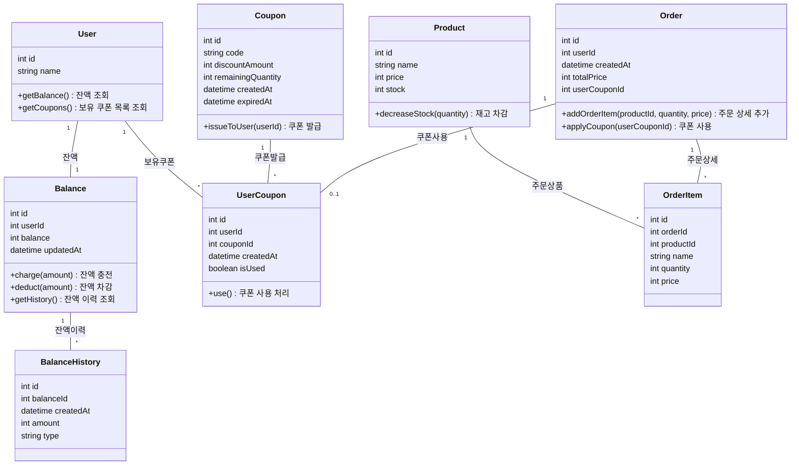

```mermaid
classDiagram
    class User {
        int id
        string name

        +getBalance() 잔액 조회
        +getCoupons() 보유 쿠폰 목록 조회
    }
    class Balance {
        int id
        int userId
        int balance
        datetime updatedAt

        +charge(amount) 잔액 충전
        +deduct(amount) 잔액 차감
        +getHistory() 잔액 이력 조회
    }
    class BalanceHistory {
        int id
        int balanceId
        datetime createdAt
        int amount
        string type
    }
    class UserCoupon {
        int id
        int userId
        int couponId
        datetime createdAt
        boolean isUsed

        +use() 쿠폰 사용 처리
    }
    class Coupon {
        int id
        string code
        int discountAmount
        int remainingQuantity
        datetime createdAt
        datetime expiredAt

        +issueToUser(userId) 쿠폰 발급
    }
    class Product {
        int id
        string name
        int price
        int stock

        +decreaseStock(quantity) 재고 차감
    }
    class Order {
        int id
        int userId
        datetime createdAt
        int totalPrice
        int userCouponId

        +addOrderItem(productId, quantity, price) 주문 상세 추가
        +applyCoupon(userCouponId) 쿠폰 사용
    }
    class OrderItem {
        int id
        int orderId
        int productId
        string name
        int quantity
        int price
    }

    User "1" -- "1" Balance : 잔액
    Balance "1" -- "*" BalanceHistory : 잔액이력
    User "1" -- "*" UserCoupon : 보유쿠폰
    Coupon "1" -- "*" UserCoupon : 쿠폰발급
    Product "1" -- "*" OrderItem : 주문상품
    Order "1" -- "*" OrderItem : 주문상세
    Order "1" -- "0..1" UserCoupon : 쿠폰사용
```