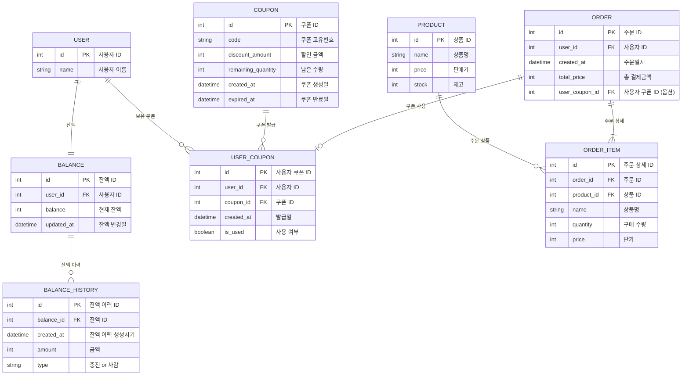

```mermaid
erDiagram
    USER {
        int id PK "사용자 ID"
        string name "사용자 이름"
    }
    BALANCE {
        int id PK "잔액 ID"
        int user_id FK "사용자 ID"
        int balance "현재 잔액"
        datetime updated_at "잔액 변경일"
    }
    BALANCE_HISTORY {
        int id PK "잔액 이력 ID"
        int balance_id FK "잔액 ID"
        datetime created_at "잔액 이력 생성시기"
        int amount "금액"
        string type "충전 or 차감"
    }
    USER_COUPON {
        int id PK "사용자 쿠폰 ID"
        int user_id FK "사용자 ID"
        int coupon_id FK "쿠폰 ID"
        datetime created_at "발급일"
        boolean is_used "사용 여부"
    }
    COUPON {
        int id PK "쿠폰 ID"
        string code "쿠폰 고유번호"
        int discount_amount "할인 금액"
        int remaining_quantity "남은 수량"
        datetime created_at "쿠폰 생성일"
        datetime expired_at "쿠폰 만료일"
    }
    PRODUCT {
        int id PK "상품 ID"
        string name "상품명"
        int price "판매가"
        int stock "재고"
    }
    "ORDER" {
        int id PK "주문 ID"
        int user_id FK "사용자 ID"
        datetime created_at "주문일시"
        int total_price "총 결제금액"
        int user_coupon_id FK "사용자 쿠폰 ID (옵션)"
    }
    ORDER_ITEM {
        int id PK "주문 상세 ID"
        int order_id FK "주문 ID"
        int product_id FK "상품 ID"
        string name "상품명"
        int quantity "구매 수량"
        int price "단가"
    }

    USER ||--|| BALANCE : "잔액"
    BALANCE ||--o{ BALANCE_HISTORY : "잔액 이력"
    USER ||--o{ USER_COUPON : "보유 쿠폰"
    COUPON ||--o{ USER_COUPON : "쿠폰 발급"
    PRODUCT ||--o{ ORDER_ITEM : "주문 상품"
    "ORDER" ||--|{ ORDER_ITEM : "주문 상세"
    "ORDER" ||--o| USER_COUPON : "쿠폰 사용"
```