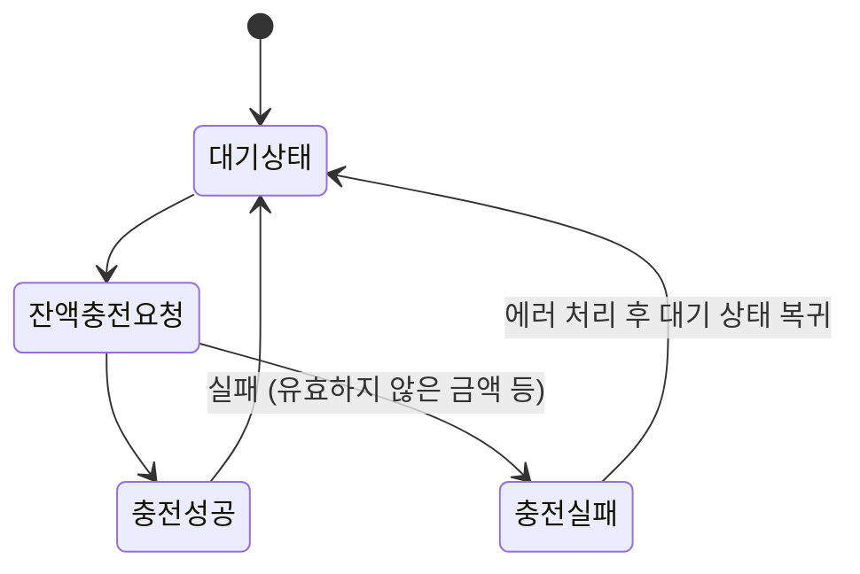
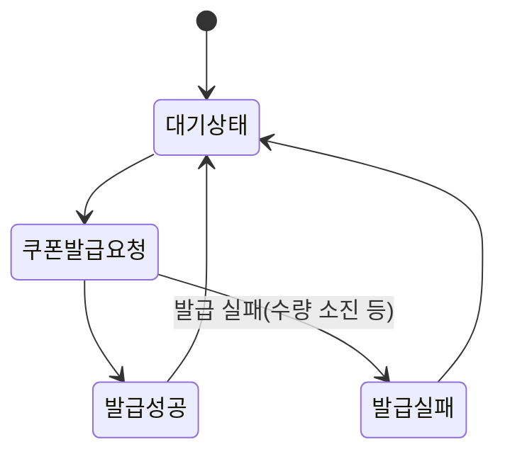
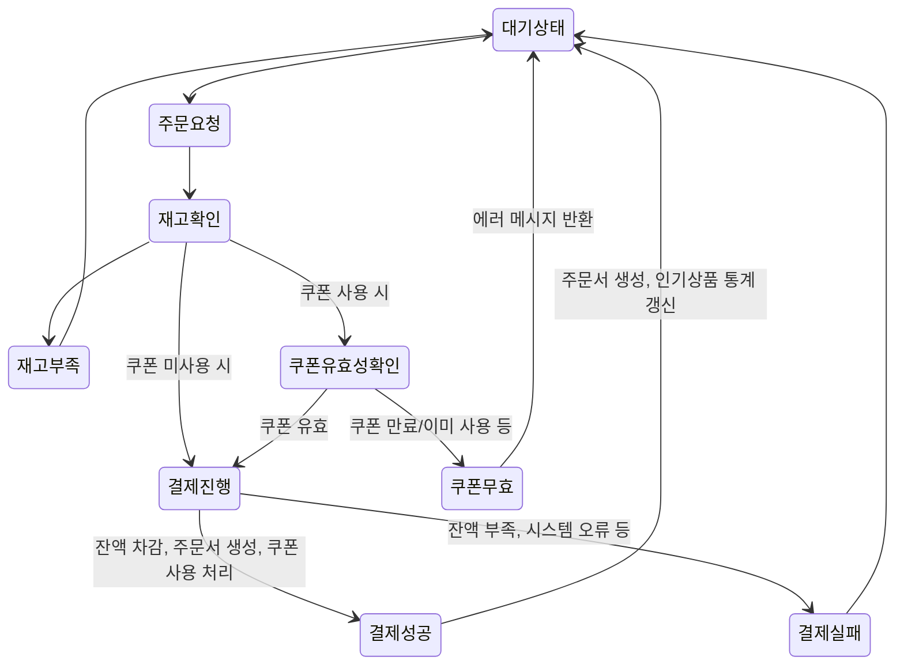

# 상태 다이어그램

## 1. 잔액 충전 상태 다이어그램

```mermaid
stateDiagram-v2
    [*] --> 대기상태
    대기상태 --> 잔액충전요청
    잔액충전요청 --> 충전성공
    잔액충전요청 --> 충전실패 : 실패 (유효하지 않은 금액 등)
    충전성공 --> 대기상태
    충전실패 --> 대기상태 : 에러 처리 후 대기 상태 복귀
    %% 각 상태는 잔액 충전 흐름을 나타냄
```

---

## 2. 쿠폰 발급 상태 다이어그램

```mermaid
stateDiagram-v2
    [*] --> 대기상태
    대기상태 --> 쿠폰발급요청
    쿠폰발급요청 --> 발급성공
    쿠폰발급요청 --> 발급실패 : 발급 실패(수량 소진 등)
    발급성공 --> 대기상태
    발급실패 --> 대기상태
```

---

## 3. 주문 상태 다이어그램

```mermaid
stateDiagram-v2
    대기상태 --> 주문요청
    주문요청 --> 재고확인
    재고확인 --> 재고부족
    재고확인 --> 쿠폰유효성확인 : 쿠폰 사용 시
    재고확인 --> 결제진행 : 쿠폰 미사용 시
    쿠폰유효성확인 --> 쿠폰무효 : 쿠폰 만료/이미 사용 등
    쿠폰유효성확인 --> 결제진행 : 쿠폰 유효
    결제진행 --> 결제성공 : 잔액 차감, 주문서 생성, 쿠폰 사용 처리
    결제진행 --> 결제실패 : 잔액 부족, 시스템 오류 등
    결제성공 --> 대기상태 : 주문서 생성, 인기상품 통계 갱신
    결제실패 --> 대기상태
    재고부족 --> 대기상태
    쿠폰무효 --> 대기상태 : 에러 메시지 반환
```
