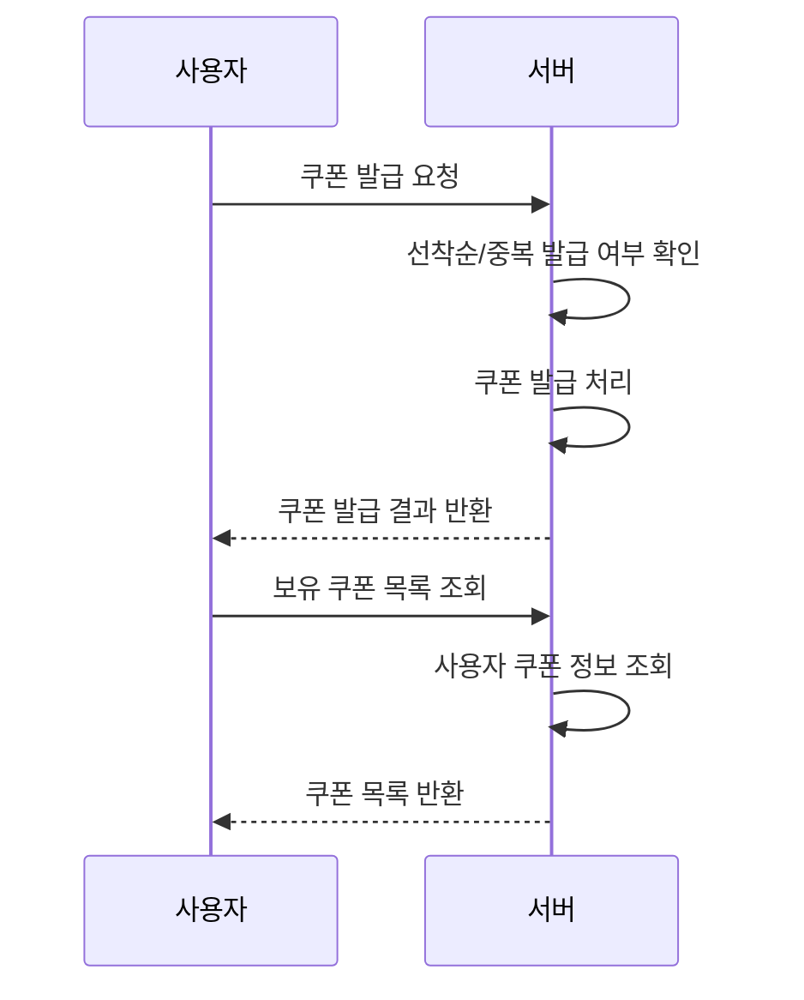

# 선착순 쿠폰
## 정책
- 쿠폰은 1,000원 할인 등 다양한 금액으로 발급됩니다. (예: 1,000원, 5,000원 등)
- 쿠폰에는 고유 번호와 발급 수량, 만료 기간이 지정됩니다.
- 사용자에게는 각기 다른 고유 번호의 쿠폰만 발급됩니다.

```mermaid
sequenceDiagram
    participant 사용자
    participant 서버

    사용자->>서버: 쿠폰 발급 요청
    서버->>서버: 선착순/중복 발급 여부 확인
    서버->>서버: 쿠폰 발급 처리
    서버-->>사용자: 쿠폰 발급 결과 반환

    사용자->>서버: 보유 쿠폰 목록 조회
    서버->>서버: 사용자 쿠폰 정보 조회
    서버-->>사용자: 쿠폰 목록 반환
```