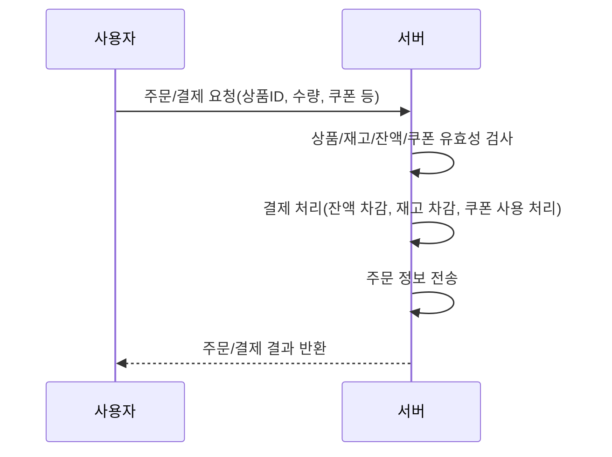

# 주문/결제 
## 정책
- 상품 아이디, 구매 수량을 전달하면 결제가 완료됩니다.
- 결제가 성공하면 해당 상품의 재고는 수량만큼 차감됩니다.
- 결제가 실패하는 경우는 다음과 같습니다.
    - 상품 정보가 존재하지 않는 경우
    - 재고가 없는 경우
    - 충전 금액이 부족한 경우
    - 만료된 쿠폰을 사용한 경우

```mermaid
sequenceDiagram
    participant 사용자
    participant 서버

    사용자->>서버: 주문/결제 요청(상품ID, 수량, 쿠폰 등)
    서버->>서버: 상품/재고/잔액/쿠폰 유효성 검사
    서버->>서버: 결제 처리(잔액 차감, 재고 차감, 쿠폰 사용 처리)
    서버->>서버: 주문 정보 전송
    서버-->>사용자: 주문/결제 결과 반환
```